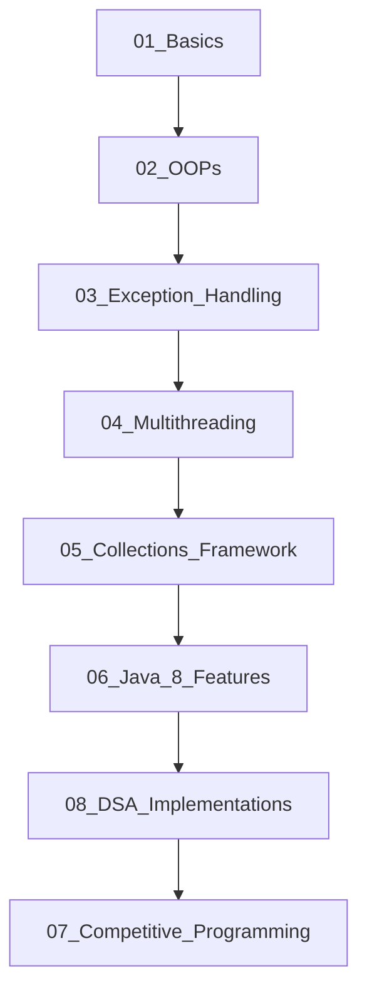

# ZeroToElite: A Comprehensive Java Learning Journey

Welcome to **ZeroToElite**! This repository is a structured, step-by-step learning guide designed to take you from a absolute beginner in Java to a highly capable ("Elite") software engineer.

The curriculum starts with the absolute fundamentals of syntax and proceeds logically through Object-Oriented Programming (OOP) design, exception safety, concurrency, collections, functional programming, and competitive programming patterns.

> 📊 **Master Progress Tracker**: [PROGRESS_TRACKER.md](file:///c:/Users/kausi/Desktop/My%20Learning/java/PROGRESS_TRACKER.md)  
> 🧭 **Engineering Roadmap**: [ROADMAP.md](file:///c:/Users/kausi/Desktop/My%20Learning/java/ROADMAP.md)

---

## 🗺️ Learning Roadmap



### 📁 Directory Breakdown

#### 📂 [01_Basics](file:///c:/Users/kausi/Desktop/java/01_Basics/)
*Focus: Java Syntax & Basic Logic*
* [VariablesAndOperators.java](file:///c:/Users/kausi/Desktop/java/01_Basics/VariablesAndOperators.java): Explains primitive data types, variable updates, basic arithmetic, and increment/decrement operators.
* [ControlFlowAndScanner.java](file:///c:/Users/kausi/Desktop/java/01_Basics/ControlFlowAndScanner.java): Demonstrates console inputs (`Scanner`), condition checks (`if-else`), loops (`for`, `while`), and classic algorithms (Factorial, Fibonacci, tables).
* [StringBasics.java](file:///c:/Users/kausi/Desktop/java/01_Basics/StringBasics.java): Analyzes string references, String Pool vs Heap, common methods, and mutable `StringBuilder` / `StringBuffer`.
* 🎒 **Practice Exercises**: [Exercises.md](file:///c:/Users/kausi/Desktop/java/01_Basics/Exercises.md) | [Practice Template](file:///c:/Users/kausi/Desktop/java/01_Basics/BasicsPractice.java) | [Solutions](file:///c:/Users/kausi/Desktop/java/01_Basics/solutions/BasicsSolutions.java)

#### 📂 [02_OOPs](file:///c:/Users/kausi/Desktop/java/02_OOPs/)
*Focus: Object-Oriented Principles*
* [ConstructorChaining.java](file:///c:/Users/kausi/Desktop/java/02_OOPs/ConstructorChaining.java): Covers default/parameterized constructors, constructor overloading, copy constructors, and chaining using `this()` and `super()`.
* [InheritanceTypes.java](file:///c:/Users/kausi/Desktop/java/02_OOPs/InheritanceTypes.java): Details single, multilevel, hierarchical, and multiple inheritance (via interfaces), explaining the Diamond Problem.
* [PolymorphismAndDispatch.java](file:///c:/Users/kausi/Desktop/java/02_OOPs/PolymorphismAndDispatch.java): Explores compile-time polymorphism (overloading), runtime polymorphism (overriding), dynamic method dispatch, and a clean polymorphic design pattern.
* [EncapsulationAndAbstraction.java](file:///c:/Users/kausi/Desktop/java/02_OOPs/EncapsulationAndAbstraction.java): Demonstrates getter/setter validation, abstract classes, and interfaces.
* 🎒 **Practice Exercises**: [Exercises.md](file:///c:/Users/kausi/Desktop/java/02_OOPs/Exercises.md) | [Practice Template](file:///c:/Users/kausi/Desktop/java/02_OOPs/OOPsPractice.java) | [Solutions](file:///c:/Users/kausi/Desktop/java/02_OOPs/solutions/OOPsSolutions.java)

#### 📂 [03_Exception_Handling](file:///c:/Users/kausi/Desktop/java/03_Exception_Handling/)
*Focus: Robust Error & Resource Management*
* [ExceptionHandlingDemo.java](file:///c:/Users/kausi/Desktop/java/03_Exception_Handling/ExceptionHandlingDemo.java): Explores checked vs unchecked exceptions, try-catch-finally blocks, throwing exceptions, and writing custom exceptions.
* [TryWithResourcesDemo.java](file:///c:/Users/kausi/Desktop/java/03_Exception_Handling/TryWithResourcesDemo.java): Highlights the modern try-with-resources statement (`AutoCloseable` interface) for auto-closing files/database streams.
* 🎒 **Practice Exercises**: [Exercises.md](file:///c:/Users/kausi/Desktop/java/03_Exception_Handling/Exercises.md) | [Practice Template](file:///c:/Users/kausi/Desktop/java/03_Exception_Handling/ExceptionPractice.java) | [Solutions](file:///c:/Users/kausi/Desktop/java/03_Exception_Handling/solutions/ExceptionSolutions.java)

#### 📂 [04_Multithreading](file:///c:/Users/kausi/Desktop/java/04_Multithreading/)
*Focus: Concurrency & Synchronization*
* [ThreadSynchronization.java](file:///c:/Users/kausi/Desktop/java/04_Multithreading/ThreadSynchronization.java): Illustrates thread creation (`Runnable`), race conditions, and locking critical sections using `synchronized` methods.
* [WaitNotifyDemo.java](file:///c:/Users/kausi/Desktop/java/04_Multithreading/WaitNotifyDemo.java): Demonstrates inter-thread communication using thread signals (`wait()` and `notify()`).
* [ReadWriteLockDemo.java](file:///c:/Users/kausi/Desktop/java/04_Multithreading/ReadWriteLockDemo.java): Demonstrates advanced lock APIs (`ReentrantReadWriteLock`) to optimize read-heavy systems.
* 🎒 **Practice Exercises**: [Exercises.md](file:///c:/Users/kausi/Desktop/java/04_Multithreading/Exercises.md) | [Practice Template](file:///c:/Users/kausi/Desktop/java/04_Multithreading/MultithreadingPractice.java) | [Solutions](file:///c:/Users/kausi/Desktop/java/04_Multithreading/solutions/MultithreadingSolutions.java)

#### 📂 [05_Collections_Framework](file:///c:/Users/kausi/Desktop/java/05_Collections_Framework/) *(New)*
*Focus: Data Structures in Java*
* [CollectionsDemo.java](file:///c:/Users/kausi/Desktop/java/05_Collections_Framework/CollectionsDemo.java): Comprehensive guide on lists (`ArrayList`, `LinkedList`), sets (`HashSet`, `TreeSet`), maps (`HashMap`, `TreeMap`), and queues (`PriorityQueue`), including key operations and complexity.
* 🎒 **Practice Exercises**: [Exercises.md](file:///c:/Users/kausi/Desktop/java/05_Collections_Framework/Exercises.md) | [Practice Template](file:///c:/Users/kausi/Desktop/java/05_Collections_Framework/CollectionsPractice.java) | [Solutions](file:///c:/Users/kausi/Desktop/java/05_Collections_Framework/solutions/CollectionsSolutions.java)

#### 📂 [06_Java_8_Features](file:///c:/Users/kausi/Desktop/java/06_Java_8_Features/) *(New)*
*Focus: Modern Java Programming*
* [LambdaAndStreams.java](file:///c:/Users/kausi/Desktop/java/06_Java_8_Features/LambdaAndStreams.java): Teaches Lambda expressions, functional interfaces, and stream pipelining (filter, map, sorted, collect, grouping).
* 🎒 **Practice Exercises**: [Exercises.md](file:///c:/Users/kausi/Desktop/java/06_Java_8_Features/Exercises.md) | [Practice Template](file:///c:/Users/kausi/Desktop/java/06_Java_8_Features/Java8Practice.java) | [Solutions](file:///c:/Users/kausi/Desktop/java/06_Java_8_Features/solutions/Java8Solutions.java)

#### 📂 [07_Competitive_Programming](file:///c:/Users/kausi/Desktop/java/07_Competitive_Programming/)
*Focus: Interview & Competitive Coding*
* [TwoSum.java](file:///c:/Users/kausi/Desktop/java/07_Competitive_Programming/TwoSum.java): Optimal $O(n)$ hash-based solution for the Two-Sum problem.
* [ArrayProblems.java](file:///c:/Users/kausi/Desktop/java/07_Competitive_Programming/ArrayProblems.java): In-place array reversal, linear max-finding, and finding the maximum product of a triplet in $O(n)$ time.
* [KadanesAlgorithm.java](file:///c:/Users/kausi/Desktop/java/07_Competitive_Programming/KadanesAlgorithm.java): Maximum Subarray Sum via Kadane's algorithm, index tracking, and circular subarray variations in $O(n)$ time.
* [TrappingRainWater.java](file:///c:/Users/kausi/Desktop/java/07_Competitive_Programming/TrappingRainWater.java): Trapping Rain Water problem implemented via Two-Pointer ($O(1)$ space), Dynamic Programming, and Monotonic Stack.
* 🎒 **Practice Exercises**: [Exercises.md](file:///c:/Users/kausi/Desktop/java/07_Competitive_Programming/Exercises.md) | [Practice Template](file:///c:/Users/kausi/Desktop/java/07_Competitive_Programming/CompetitivePractice.java) | [Solutions](file:///c:/Users/kausi/Desktop/java/07_Competitive_Programming/solutions/CompetitiveSolutions.java)

#### 📂 [08_DSA_Implementations](file:///c:/Users/kausi/Desktop/java/08_DSA_Implementations/) *(New)*
*Focus: Custom Data Structures and Algorithms Implementations*
* [MergeSort.java](file:///c:/Users/kausi/Desktop/My%20Learning/java/08_DSA_Implementations/MergeSort.java): Top-down divide-and-conquer stable sorting with auxiliary buffer reuse and O(N log N) guarantee.
* [QuickSort.java](file:///c:/Users/kausi/Desktop/My%20Learning/java/08_DSA_Implementations/QuickSort.java): In-place divide-and-conquer sorting with randomized pivot, Lomuto and Hoare partitioning.
* [DynamicArray.java](file:///c:/Users/kausi/Desktop/My%20Learning/java/08_DSA_Implementations/DynamicArray.java): Generic resizing array with geometric doubling, amortized O(1) appends, and capacity shrinking.
* [MinStack.java](file:///c:/Users/kausi/Desktop/My%20Learning/java/08_DSA_Implementations/MinStack.java): Constant time O(1) getMin stack using dual parallel stack and embedded linked node designs.
* [BinaryTreeTraversals.java](file:///c:/Users/kausi/Desktop/My%20Learning/java/08_DSA_Implementations/BinaryTreeTraversals.java): BFS Level-Order (Queue), DFS Pre/In/Post-Order (both Recursive & Iterative Stack), and tree height.
* [BinaryHeap.java](file:///c:/Users/kausi/Desktop/My%20Learning/java/08_DSA_Implementations/BinaryHeap.java): Complete binary tree array representation, MinHeap, O(N) buildHeap, and in-place HeapSort.
* [SearchingAndSorting.java](file:///c:/Users/kausi/Desktop/My%20Learning/java/08_DSA_Implementations/SearchingAndSorting.java): Implements Linear Search, Binary Search, Bubble Sort, and Selection Sort.
* [SinglyLinkedList.java](file:///c:/Users/kausi/Desktop/My%20Learning/java/08_DSA_Implementations/SinglyLinkedList.java): Covers singly linked list nodes, pointer traversal, insertions, and deletions.
* [DoublyLinkedList.java](file:///c:/Users/kausi/Desktop/My%20Learning/java/08_DSA_Implementations/DoublyLinkedList.java): Covers doubly linked list nodes, pointer traversal in both directions, and insertions.
* [CircularLinkedList.java](file:///c:/Users/kausi/Desktop/My%20Learning/java/08_DSA_Implementations/CircularLinkedList.java): Implements a circular linked list pointing back to head.
* [Queues.java](file:///c:/Users/kausi/Desktop/My%20Learning/java/08_DSA_Implementations/Queues.java): Custom Array-based Simple Queue and Circular Queue implementations.
* [BinarySearchTree.java](file:///c:/Users/kausi/Desktop/My%20Learning/java/08_DSA_Implementations/BinarySearchTree.java): Implements Binary Search Tree insertion, in-order traversal, searching, and BST validation.
* [ValidParentheses.java](file:///c:/Users/kausi/Desktop/My%20Learning/java/08_DSA_Implementations/ValidParentheses.java): Implements stack-based bracket validation, minimum additions, and longest valid parentheses substring.
* [MatrixOperations.java](file:///c:/Users/kausi/Desktop/My%20Learning/java/08_DSA_Implementations/MatrixOperations.java): Implements 2D array addition and multiplication.
* [BasicAlgorithms.java](file:///c:/Users/kausi/Desktop/My%20Learning/java/08_DSA_Implementations/BasicAlgorithms.java): Implements Armstrong check, palindrome check, reversing digits, duplicate elements detection, and character occurrences.
* 📖 **Topic Documentation**: [08_DSA_Implementations/README.md](file:///c:/Users/kausi/Desktop/My%20Learning/java/08_DSA_Implementations/README.md)
* 🎒 **Practice Exercises**: [Exercises.md](file:///c:/Users/kausi/Desktop/My%20Learning/java/08_DSA_Implementations/Exercises.md) | [Practice Template](file:///c:/Users/kausi/Desktop/My%20Learning/java/08_DSA_Implementations/DSAPractice.java) | [Solutions](file:///c:/Users/kausi/Desktop/My%20Learning/java/08_DSA_Implementations/solutions/DSASolutions.java)

---

## 🛠️ How to Compile and Run

To run any of the files in this repository, open your terminal at the root directory of this project and use standard JDK commands:

### 1. Compile the file
```powershell
javac 01_Basics/VariablesAndOperators.java
```

### 2. Run the class
```powershell
java basics.VariablesAndOperators
```
*(Make sure to specify the fully qualified name since the files are organized under packages like `basics`, `oops`, `exceptions`, `multithreading`, `collections`, `features`, and `competitive`.)*

Alternatively, you can compile all files into a separate output directory and execute:
```powershell
javac -d bin 01_Basics/*.java
java -cp bin basics.VariablesAndOperators
```
