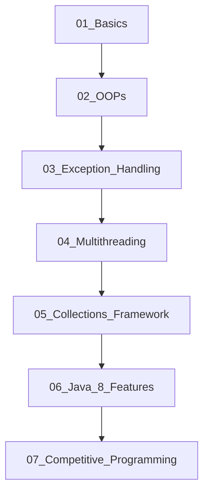

# ZeroToElite: A Comprehensive Java Learning Journey

Welcome to **ZeroToElite**! This repository is a structured, step-by-step learning guide designed to take you from a absolute beginner in Java to a highly capable ("Elite") software engineer.

The curriculum starts with the absolute fundamentals of syntax and proceeds logically through Object-Oriented Programming (OOP) design, exception safety, concurrency, collections, functional programming, and competitive programming patterns.

---

## 🗺️ Learning Roadmap



### 📁 Directory Breakdown

#### 📂 [01_Basics](file:///c:/Users/kausi/Desktop/java/01_Basics/)
*Focus: Java Syntax & Basic Logic*
* [VariablesAndOperators.java](file:///c:/Users/kausi/Desktop/java/01_Basics/VariablesAndOperators.java): Explains primitive data types, variable updates, basic arithmetic, and increment/decrement operators.
* [ControlFlowAndScanner.java](file:///c:/Users/kausi/Desktop/java/01_Basics/ControlFlowAndScanner.java): Demonstrates console inputs (`Scanner`), condition checks (`if-else`), loops (`for`, `while`), and classic algorithms (Factorial, Fibonacci, tables).
* [StringBasics.java](file:///c:/Users/kausi/Desktop/java/01_Basics/StringBasics.java): Analyzes string references, String Pool vs Heap, common methods, and mutable `StringBuilder` / `StringBuffer`.

#### 📂 [02_OOPs](file:///c:/Users/kausi/Desktop/java/02_OOPs/)
*Focus: Object-Oriented Principles*
* [ConstructorChaining.java](file:///c:/Users/kausi/Desktop/java/02_OOPs/ConstructorChaining.java): Covers default/parameterized constructors, constructor overloading, copy constructors, and chaining using `this()` and `super()`.
* [InheritanceTypes.java](file:///c:/Users/kausi/Desktop/java/02_OOPs/InheritanceTypes.java): Details single, multilevel, hierarchical, and multiple inheritance (via interfaces), explaining the Diamond Problem.
* [PolymorphismAndDispatch.java](file:///c:/Users/kausi/Desktop/java/02_OOPs/PolymorphismAndDispatch.java): Explores compile-time polymorphism (overloading), runtime polymorphism (overriding), dynamic method dispatch, and a clean polymorphic design pattern.
* [EncapsulationAndAbstraction.java](file:///c:/Users/kausi/Desktop/java/02_OOPs/EncapsulationAndAbstraction.java): Demonstrates getter/setter validation, abstract classes, and interfaces.

#### 📂 [03_Exception_Handling](file:///c:/Users/kausi/Desktop/java/03_Exception_Handling/)
*Focus: Robust Error & Resource Management*
* [ExceptionHandlingDemo.java](file:///c:/Users/kausi/Desktop/java/03_Exception_Handling/ExceptionHandlingDemo.java): Explores checked vs unchecked exceptions, try-catch-finally blocks, throwing exceptions, and writing custom exceptions.
* [TryWithResourcesDemo.java](file:///c:/Users/kausi/Desktop/java/03_Exception_Handling/TryWithResourcesDemo.java): Highlights the modern try-with-resources statement (`AutoCloseable` interface) for auto-closing files/database streams.

#### 📂 [04_Multithreading](file:///c:/Users/kausi/Desktop/java/04_Multithreading/)
*Focus: Concurrency & Synchronization*
* [ThreadSynchronization.java](file:///c:/Users/kausi/Desktop/java/04_Multithreading/ThreadSynchronization.java): Illustrates thread creation (`Runnable`), race conditions, and locking critical sections using `synchronized` methods.
* [WaitNotifyDemo.java](file:///c:/Users/kausi/Desktop/java/04_Multithreading/WaitNotifyDemo.java): Demonstrates inter-thread communication using thread signals (`wait()` and `notify()`).
* [ReadWriteLockDemo.java](file:///c:/Users/kausi/Desktop/java/04_Multithreading/ReadWriteLockDemo.java): Demonstrates advanced lock APIs (`ReentrantReadWriteLock`) to optimize read-heavy systems.

#### 📂 [05_Collections_Framework](file:///c:/Users/kausi/Desktop/java/05_Collections_Framework/) *(New)*
*Focus: Data Structures in Java*
* [CollectionsDemo.java](file:///c:/Users/kausi/Desktop/java/05_Collections_Framework/CollectionsDemo.java): Comprehensive guide on lists (`ArrayList`, `LinkedList`), sets (`HashSet`, `TreeSet`), maps (`HashMap`, `TreeMap`), and queues (`PriorityQueue`), including key operations and complexity.

#### 📂 [06_Java_8_Features](file:///c:/Users/kausi/Desktop/java/06_Java_8_Features/) *(New)*
*Focus: Modern Java Programming*
* [LambdaAndStreams.java](file:///c:/Users/kausi/Desktop/java/06_Java_8_Features/LambdaAndStreams.java): Teaches Lambda expressions, functional interfaces, and stream pipelining (filter, map, sorted, collect, grouping).

#### 📂 [07_Competitive_Programming](file:///c:/Users/kausi/Desktop/java/07_Competitive_Programming/)
*Focus: Interview & Competitive Coding*
* [TwoSum.java](file:///c:/Users/kausi/Desktop/java/07_Competitive_Programming/TwoSum.java): Optimal $O(n)$ hash-based solution for the Two-Sum problem.
* [ArrayProblems.java](file:///c:/Users/kausi/Desktop/java/07_Competitive_Programming/ArrayProblems.java): In-place array reversal, linear max-finding, and finding the maximum product of a triplet in $O(n)$ time.

---

## 🛠️ How to Compile and Run

To run any of the files in this repository, open your terminal at the root directory of this project and use standard JDK commands:

### 1. Compile the file
```powershell
javac 01_Basics/VariablesAndOperators.java
```

### 2. Run the class
```powershell
java basics.VariablesAndOperators
```
*(Make sure to specify the fully qualified name since the files are organized under packages like `basics`, `oops`, `exceptions`, `multithreading`, `collections`, `features`, and `competitive`.)*

Alternatively, you can compile all files into a separate output directory and execute:
```powershell
javac -d bin 01_Basics/*.java
java -cp bin basics.VariablesAndOperators
```
