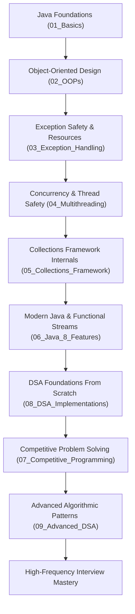

# 🧭 ZeroToElite: Engineering & DSA Roadmap

This roadmap documents the end-to-end journey from foundational Java syntax to advanced data structures, algorithmic paradigms, and interview mastery.

---

## 🗺️ High-Level Learning Flow

---

## 📍 Stage 1: Completed Milestones

### 1. Java Syntax & Core Logic (`01_Basics`)
- Primitive types, memory size, arithmetic overflow behavior
- Branching logic, conditional jumps, scanner input
- String Immutability, String Constant Pool, Heap allocation, and mutable `StringBuilder`

### 2. Object-Oriented Programming (`02_OOPs`)
- Explicit constructor chaining via `this()` and `super()`
- Inheritance hierarchies and solving the Diamond Problem with Interfaces
- Dynamic method dispatch, virtual method tables (vtable), and runtime polymorphism
- Encapsulation with invariant validation and interface abstraction

### 3. Exception Safety & Resource Management (`03_Exception_Handling`)
- Checked vs unchecked exception hierarchy
- Proper `try-catch-finally` cleanup semantics
- Java 7 Automatic Resource Management (ARM) via `AutoCloseable`
- Custom domain exception architectures

### 4. Concurrency & Multithreading (`04_Multithreading`)
- Thread creation, lifecycle, and critical sections
- Intrinsic monitors, race conditions, and `synchronized` blocks
- Inter-thread signaling with `wait()`, `notify()`, and `notifyAll()`
- Advanced lock APIs with `ReentrantReadWriteLock`

### 5. Java Collections Framework (`05_Collections_Framework`)
- `List`: Array-backed vs node-backed structures
- `Set`: Hashing sets vs self-balancing Red-Black trees (`TreeSet`)
- `Map`: Hash tables vs sorted tree maps (`TreeMap`)
- `Queue` & `PriorityQueue`: Binary heap backed priority queues

### 6. Modern Java 8+ Features (`06_Java_8_Features`)
- Lambdas and closures in the JVM
- Core functional interfaces: `Predicate<T>`, `Function<T, R>`, `Consumer<T>`, `Supplier<T>`
- Stream pipelines: lazy evaluation, intermediate transformations, terminal collectors

---

## 🎯 Stage 2: Current Focus — Completing DSA Foundations (`08_DSA_Implementations`)

Before moving into heavy pattern solving, the foundational data structures and $O(N \log N)$ divide-and-conquer algorithms must be mastered and implemented from scratch:

- [x] Singly, Doubly, and Circular Linked Lists
- [x] Array-based Simple Queue & Circular Queue with modulo indexing
- [x] Binary Search Tree insertion, in-order traversal, and range validation
- [x] Bracket validation and monotonic stack applications
- [x] Elementary sorting ($O(N^2)$ Bubble & Selection Sort)
- [x] Divide-and-Conquer Sorting (**Merge Sort** with stable merging, **Quick Sort** with Lomuto/Hoare partitioning)
- [x] Dynamic Resizing Array (**DynamicArray\<T\>**) with amortized $O(1)$ analysis
- [x] Constant Time **MinStack** ($O(1)$ `getMin()`)
- [x] Complete **Binary Tree Traversals** (BFS Level-Order via Queue, DFS Pre/In/Post Order recursive & iterative)
- [x] From-scratch **Binary Min/Max Heap** with $O(N)$ `buildHeap` and **Heap Sort**
- [ ] **Next Batch Focus**: Fast & Slow Pointer mechanics (**Floyd's Cycle Detection**, finding cycle start, and list middle) + From-scratch **Hash Table** with Separate Chaining

---

## 🚀 Stage 3: Next Stage — Advanced DSA & Interview Patterns (`09_Advanced_DSA`)

Once foundations are completed, the repository will advance into dedicated pattern-based problem modules:

1. **Two Pointers & Sliding Window** (Opposite direction, same direction, fixed window, dynamic frequency window)
2. **Binary Search Invariants** (Lower bound, upper bound, rotated search, binary search on answer)
3. **Monotonic Stacks & Queues** (Next Greater Element, Daily Temperatures, Largest Rectangle in Histogram, Sliding Window Maximum)
4. **Tree Patterns & Binary Trees** (Diameter, Path Sum, Lowest Common Ancestor, Tree Serialization)
5. **Heap & Top-K Problems** (Kth largest, Merge K Sorted Lists, Median of Data Stream)
6. **Recursion & Backtracking** (Subsets, Permutations, Combination Sum, Word Search, N-Queens)
7. **Graph Algorithms** (Adjacency List, BFS, DFS, Cycle Detection, Topological Sort, Dijkstra, Disjoint Set Union)
8. **Dynamic Programming** (1D DP, 2D Grid DP, 0/1 Knapsack, Longest Common Subsequence, Longest Increasing Subsequence)

---

## 🏆 Stage 4: Interview Mastery & Competitive Edge

- System Design & Low-Level Design (LLD) concepts in Java
- Concurrency utilities (`ExecutorService`, `ConcurrentHashMap`, `CompletableFuture`)
- Fast I/O and competitive programming number theory (GCD, Sieve of Eratosthenes, Modular Arithmetic)
- Time and space complexity defense in mock interview settings

---

*Roadmap established to ensure ZeroToElite remains a rigorous, pedagogical engineering artifact.*
